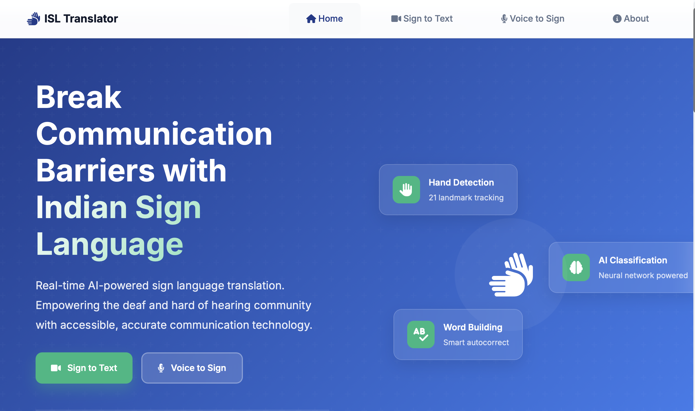
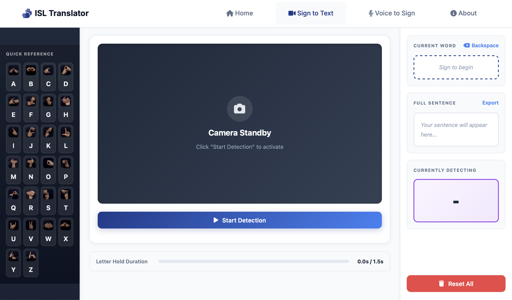
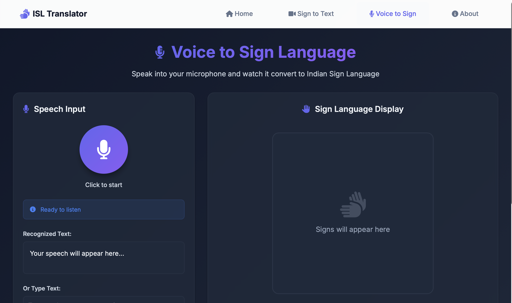

# Indian Sign Language (ISL) Translator

## Project Overview

This is a comprehensive Indian Sign Language (ISL) translation web application built with Flask, OpenCV, MediaPipe, and TensorFlow. The application provides **bidirectional communication support**:

1. **Sign to Text**: Real-time sign language gesture recognition using webcam, automatically translating ISL gestures into text
2. **Voice/Text to Sign**: Convert spoken words or typed text into visual sign language sequences for learning and communication

This dual-functionality makes the application useful for both hearing-impaired individuals to communicate with others and for people to learn and understand sign language.

## Screenshots

### Home Page


_Landing page with navigation to different features_

### Sign to Text Detection


_Real-time sign language gesture recognition interface_

### Voice to Sign Conversion


_Speech recognition and sign language display interface_

## Features

### Sign to Text Translation

- **Real-time Detection**: Instant sign language gesture recognition using webcam
- **Word Building**: Automatically builds words from detected letters
- **Sentence Formation**: Intelligently creates sentences with automatic spacing
- **High Accuracy**: 95%+ accuracy rate with 43 supported signs (numbers 1-9 and letters A-Z)
- **Save Functionality**: Export translated sentences to text files

### Voice to Sign Translation

- **Speech Recognition**: Convert spoken words into sign language sequences
- **Manual Text Input**: Type text to convert into sign language
- **Visual Display**: Shows corresponding sign images for each letter
- **Playback Controls**: Play, pause, stop, and replay sign sequences
- **Adjustable Speed**: Control playback speed for better learning
- **Export Options**: Save sign sequences and translations

### General Features

- **Cross-platform**: Works on Windows, macOS, and Linux with optimized performance
- **Bidirectional Communication**: Supports both sign-to-text and voice/text-to-sign conversion

## Technology Stack

### Backend

- **Flask**: Python web framework for API and routing
- **TensorFlow/Keras**: Deep learning model for gesture classification
- **MediaPipe**: Hand tracking and landmark detection
- **OpenCV**: Computer vision and video processing
- **NumPy**: Numerical computations

### Frontend

- **HTML/CSS**: Responsive UI design
- **JavaScript**: Interactive client-side functionality
- **Jinja2**: Template engine for dynamic content

## Project Structure

This project is organized into a **client-server architecture** for better maintainability and deployment flexibility:

```
Indian_Sign_Language_to_Sentence_Formation/
├── README.md                   # Project documentation
├── DEPLOYMENT.md              # Deployment guide
├── requirements.txt           # Root-level dependencies (legacy)
├── Dockerfile                 # Root-level Docker configuration (legacy)
├── model.h5                   # Pre-trained Keras model (legacy)
│
├── server/                    # 🔧 Backend Flask API
│   ├── app.py                # Main Flask application & API endpoints
│   ├── model.h5              # Pre-trained gesture classification model
│   ├── requirements.txt      # Python dependencies for backend
│   ├── Dockerfile            # Docker configuration for server
│   ├── render.yaml           # Render deployment configuration
│   └── islvenv/              # Virtual environment (not in git)
│
├── client/                    # 🎨 Frontend Web Application
│   ├── index.html            # Home/landing page
│   ├── detector.html         # Sign-to-text detector interface
│   ├── voice_to_sign.html    # Voice/text-to-sign converter
│   ├── about.html            # About page
│   ├── render.yaml           # Render deployment configuration
│   └── static/               # Static assets
│       ├── css/              # Stylesheets
│       │   ├── base.css      # Common styles
│       │   ├── index.css     # Home page styles
│       │   ├── detector.css  # Detector page styles
│       │   ├── voice_to_sign.css
│       │   └── about.css
│       ├── images/           # Sign language images (A-Z)
│       └── js/               # JavaScript files
│           ├── main.js       # Common functionality
│           ├── detector.js   # Detector page logic
│           └── voice_to_sign.js
│
├── templates/                 # Legacy template files
├── static/                    # Legacy static files
└── Demo/                      # Demo screenshots and videos
```

### Folder Descriptions

#### 📁 `server/` - Backend API Server

The Flask-based backend that handles:

- Real-time sign language detection using webcam
- Hand landmark detection with MediaPipe
- Gesture classification using TensorFlow/Keras
- Video streaming and processing
- API endpoints for sign detection and text-to-sign conversion

#### 📁 `client/` - Frontend Web Application

Static HTML/CSS/JS frontend that provides:

- User interface for all features
- Webcam integration for sign detection
- Voice recognition for speech-to-sign
- Interactive controls and displays
- Responsive design for different devices

## Installation & Setup

This project has separate setup instructions for the **server** (backend API) and **client** (frontend). You can run them independently or together.

### Prerequisites

- **Python 3.8+** (recommended: Python 3.10)
- **Webcam/Camera** (for sign detection)
- **pip** package manager
- **Modern web browser** (Chrome, Edge, Firefox, or Safari)

---

### 🔧 Server Setup (Backend)

The server handles all the AI/ML processing, camera access, and API endpoints.

#### 1. Navigate to server directory

```bash
cd server
```

#### 2. Create a virtual environment

```bash
python -m venv islvenv
```

or if you have Python 3.10 specifically:

```bash
python3.10 -m venv islvenv
```

#### 3. Activate the virtual environment

- **macOS/Linux:**

  ```bash
  source islvenv/bin/activate
  ```

- **Windows:**
  ```bash
  islvenv\Scripts\activate
  ```

#### 4. Install server dependencies

```bash
pip install -r requirements.txt
```

#### 5. Run the Flask server

```bash
python app.py
```

The server will start on `http://localhost:5001`

**Server Endpoints:**

- `GET /` - Health check / API info
- `GET /start_detection` - Initialize camera and start detection
- `GET /stop_detection` - Stop detection and release resources
- `GET /video_stream` - Motion JPEG video stream
- `GET /get_detection` - Get detection results with video frame
- `POST /save_sentence` - Save current sentence to file
- `POST /reset_word` - Reset current word
- `POST /reset_sentence` - Reset entire sentence
- `POST /api/text_to_signs` - Convert text to sign language sequence

---

### 🎨 Client Setup (Frontend)

The client is a static web application that can be served with any HTTP server.

#### Option 1: Using Python's HTTP Server (Recommended for Development)

1. Navigate to client directory

   ```bash
   cd client
   ```

2. Start a simple HTTP server

   - **Python 3.x:**

     ```bash
     python -m http.server 8000
     ```

   - **Python 2.x:**
     ```bash
     python -m SimpleHTTPServer 8000
     ```

3. Open your browser and navigate to: `http://localhost:8000`

#### Option 2: Using Node.js http-server

1. Install http-server globally (one-time setup)

   ```bash
   npm install -g http-server
   ```

2. Navigate to client directory and run

   ```bash
   cd client
   http-server -p 8000
   ```

3. Open your browser and navigate to: `http://localhost:8000`

#### Option 3: Using VS Code Live Server

1. Install the "Live Server" extension in VS Code
2. Right-click on `client/index.html`
3. Select "Open with Live Server"

---

### 🚀 Running the Complete Application

To use the full application with all features, you need **both** the server and client running:

1. **Terminal 1 - Start the Backend Server:**

   ```bash
   cd server
   source islvenv/bin/activate  # On Windows: islvenv\Scripts\activate
   python app.py
   ```

   Server will run on `http://localhost:5001`

2. **Terminal 2 - Start the Frontend Client:**

   ```bash
   cd client
   python -m http.server 8000
   ```

   Client will run on `http://localhost:8000`

3. **Access the Application:**

   Open your browser and go to: `http://localhost:8000`

**Note:** The client needs to connect to the server API. If you change the server port from 5001, you'll need to update the API URL in the client JavaScript files (`client/static/js/*.js`).

---

### Quick Start Commands

#### Using Startup Scripts (Recommended):

**macOS/Linux:**

```bash
# Terminal 1 - Server
./start-server.sh

# Terminal 2 - Client
./start-client.sh
```

**Windows:**

```cmd
REM Terminal 1 - Server
start-server.bat

REM Terminal 2 - Client
start-client.bat
```

#### Manual Commands:

**For Full Application:**

```bash
# Terminal 1 - Server
cd server && source islvenv/bin/activate && python app.py

# Terminal 2 - Client
cd client && python -m http.server 8000
```

**Server Only (API Development):**

```bash
cd server
source islvenv/bin/activate
python app.py
```

**Client Only (Frontend Development):**

```bash
cd client
python -m http.server 8000
```

---

## 📋 Additional Resources

- **[QUICKSTART.md](QUICKSTART.md)** - Detailed troubleshooting guide and common issues
- **[DEPLOYMENT.md](DEPLOYMENT.md)** - Production deployment instructions

## Usage Guide

### Sign to Text Detection

#### Starting Detection

1. Navigate to the **Detector** page
2. Click the **"Start Detection"** button or press **Enter**
3. Allow camera permissions when prompted
4. Position your hand clearly in front of the camera

#### Making Gestures

1. **Form a sign** with your hand (A-Z or 1-9)
2. **Hold the gesture steady** for 1.5 seconds
3. The letter will be added to your current word
4. **Use the ASL H symbol** to add a space between words

#### Keyboard Shortcuts

- **Enter**: Start/Stop detection
- **Space**: Save sentence to file
- **R**: Reset current word
- **S**: Reset entire sentence

#### Controls

- **Reset Word**: Clear the current word being built
- **Reset Sentence**: Clear the entire sentence
- **Save Sentence**: Export the sentence to a timestamped text file

### Voice/Text to Sign Conversion

#### Using Voice Input

1. Navigate to the **Voice to Sign** page
2. Click the **microphone button** to start recording
3. Speak clearly into your device's microphone
4. The recognized text will appear automatically
5. Click **"Convert to Signs"** to generate the sign sequence

#### Using Manual Text Input

1. Navigate to the **Voice to Sign** page
2. Type your text in the input field
3. Click **"Convert to Signs"** to generate the sign sequence

#### Playback Controls

- **Play**: Start displaying the sign sequence
- **Pause**: Temporarily pause the playback
- **Stop**: Stop and reset the playback
- **Replay**: Start the sequence from the beginning
- **Speed Control**: Adjust playback speed (0.5x to 2x)

#### Additional Features

- **Progress Bar**: Visual indicator of playback progress
- **Statistics**: View letter count, word count, and estimated duration
- **Export**: Save the sign sequence for later reference
- **Clear**: Reset all inputs and outputs

## How It Works

### Detection Pipeline

1. **Hand Detection**: MediaPipe identifies hand landmarks (21 key points)
2. **Feature Extraction**: Landmarks are normalized and converted to feature vectors
3. **Classification**: Neural network classifies the gesture into one of 43 signs
4. **Word Building**: Detected letters are combined using timing logic

### Architecture Components

#### Backend Processing

- **Capture Thread**: Continuously grabs frames from camera
- **Processing Thread**: Processes frames for hand detection and classification
- **Threading Synchronization**: Uses locks to safely share data between threads

#### Detection Logic

- **Hold Time**: 1.5 seconds to confirm letter addition
- **Space Gesture**: ASL H symbol to add space between words
- **Frame Rate Control**: Optimized processing intervals for performance

## Model Information

The application uses a pre-trained neural network (`model.h5`) that:

- Accepts normalized hand landmark coordinates (42 values)
- Outputs probabilities for 43 classes (1-9, A-Z)
- Trained on thousands of sign language gesture samples
- Achieves 95%+ accuracy on test data

## Performance Optimization

### OS-Specific Settings

- **Windows**: More aggressive optimization for better performance

  - Lower resolution processing
  - Frame skipping
  - Disabled landmark drawing
  - DirectShow camera backend

- **macOS/Linux**: Balanced performance and quality
  - Higher resolution processing
  - Full frame processing
  - Landmark visualization enabled

### Configuration Variables

All performance settings can be adjusted in `server/app.py`:

- `FRAME_WIDTH`, `FRAME_HEIGHT`: Camera capture resolution
- `PROCESSING_WIDTH`, `PROCESSING_HEIGHT`: Processing frame size
- `JPEG_QUALITY`: Video stream compression quality
- `PROCESS_EVERY_N_FRAMES`: Frame processing frequency

## API Endpoints

### GET Routes

- `/` - Home page
- `/detector` - Detector interface page (Sign to Text)
- `/voice_to_sign` - Voice/Text to Sign converter page
- `/about` - About page
- `/start_detection` - Initialize camera and start detection
- `/stop_detection` - Stop detection and release resources
- `/get_detection_meta` - Get detection results (without video frame)
- `/get_detection` - Get detection results with video frame
- `/video_stream` - Motion JPEG video stream

### POST Routes

- `/save_sentence` - Save current sentence to file
- `/reset_word` - Reset current word
- `/reset_sentence` - Reset entire sentence
- `/api/text_to_signs` - Convert text input to sign language image sequence

## File Saving

Sentences are automatically saved to the `server/saved_sentences/` directory with:

- Timestamp in filename: `sentence_YYYYMMDD_HHMMSS.txt`
- Formatted content with date and separator
- UTF-8 encoding

## Troubleshooting

### Server Issues

#### Camera Issues

- **Camera not detected**: Ensure no other application is using the camera
- **Permission denied**: Grant camera permissions in OS settings
- **Poor performance**: Reduce `FRAME_WIDTH` and `FRAME_HEIGHT` in `server/app.py`

#### Detection Issues

- **Low accuracy**: Ensure good lighting and clear hand visibility
- **Slow response**: Increase `PROCESS_EVERY_N_FRAMES` for faster processing
- **Letters not adding**: Hold gesture steady for full 1.5 seconds

#### Performance Issues

- **High CPU usage**: Enable Windows optimizations in `server/app.py` (set `IS_WINDOWS = True`)
- **Laggy video**: Reduce `JPEG_QUALITY` or `FRAME_WIDTH`/`FRAME_HEIGHT`
- **Memory issues**: Restart the application periodically

#### Module Import Errors

- Make sure you're in the virtual environment: `source islvenv/bin/activate`
- Reinstall dependencies: `pip install -r requirements.txt`
- Check Python version: `python --version` (should be 3.8+)

### Client Issues

#### Cannot Connect to Server

- Ensure the server is running on `http://localhost:5001`
- Check for CORS errors in browser console
- Verify the API URL in `client/static/js/*.js` files matches your server address

#### Camera Not Working in Browser

- Grant camera permissions when prompted
- Use HTTPS or localhost (some browsers require secure context)
- Try a different browser (Chrome/Edge recommended)

#### Voice Recognition Not Working

- Use Chrome/Edge for best voice recognition support
- Check microphone permissions in browser
- Use manual text input as fallback in Firefox

### Port Conflicts

If port 5001 or 8000 is already in use:

**Change Server Port:**

Edit `server/app.py`:

```python
app.run(host='0.0.0.0', port=5002)  # Change to any available port
```

**Change Client Port:**

```bash
python -m http.server 9000  # Use any available port
```

**Update API URLs:**

If you change the server port, update the API endpoints in:

- `client/static/js/detector.js`
- `client/static/js/voice_to_sign.js`

Change from:

```javascript
const API_URL = "http://localhost:5001";
```

To:

```javascript
const API_URL = "http://localhost:YOUR_NEW_PORT";
```

## Browser Compatibility

### Sign Detection (Camera)

- **Chrome/Edge**: Recommended (best performance)
- **Firefox**: Fully supported
- **Safari**: Supported with minor limitations

### Voice Recognition

- **Chrome/Edge**: Full support for Web Speech API
- **Safari**: Supported on macOS and iOS
- **Firefox**: Limited support (manual text input recommended)

---

**Note**: This application requires a webcam and runs best on desktop/laptop computers with good lighting conditions.
